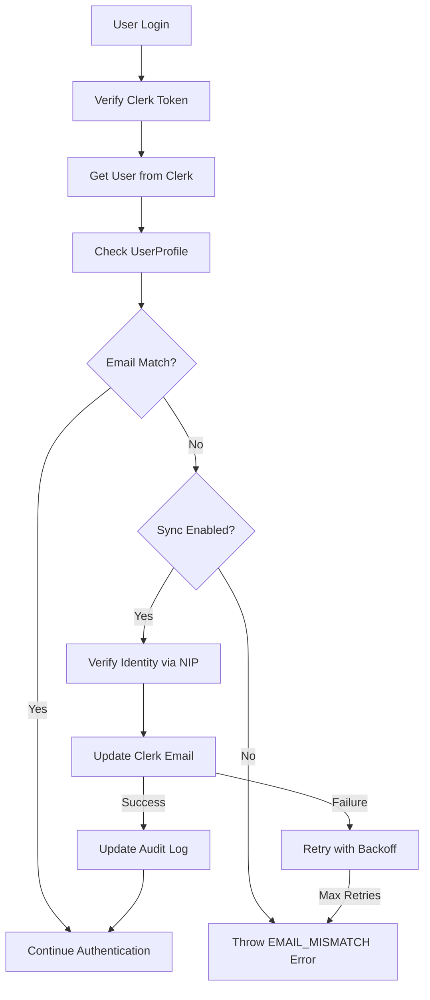

# Email Sync Implementation - Option 1

## Overview
This document describes the production-ready implementation of automatic email synchronization between DataKaryawan and Clerk authentication service.

## Problem Statement
When an employee's email is changed in the DataKaryawan table but not in Clerk, authentication fails with an `EMAIL_MISMATCH` error, preventing the user from logging in.

## Solution: Auto-Sync on Login & Profile Re-linking
The system now:
1. Automatically detects email mismatches during login and syncs the new email from DataKaryawan to Clerk
2. Handles duplicate NIP scenarios by re-linking existing profiles to new Clerk accounts
3. Provides transaction safety for all profile operations

## Implementation Details

### 1. Configuration
Add the following environment variables to control the sync behavior:

```env
# Clerk Email Sync Configuration
CLERK_AUTO_SYNC_EMAIL=true              # Enable auto-sync email on login
CLERK_SYNC_MAX_RETRIES=3               # Max retries for sync operations
CLERK_SYNC_RETRY_DELAY=1000            # Delay between retries in ms
CLERK_SYNC_TIMEOUT=5000                # Sync operation timeout in ms
```

### 2. Authentication Flow



### 3. Profile Re-linking Logic

When a user creates a new Clerk account with a different email:
1. System checks for existing UserProfile by clerkUserId
2. If not found, checks for existing profile by NIP
3. If found by NIP, updates the profile to link to new Clerk account
4. Creates comprehensive audit trail of the re-linking operation
5. Uses database transactions to ensure consistency

This handles scenarios where:
- User changes email and creates new Clerk account
- User has multiple Clerk accounts but same NIP
- Previous login attempts created orphaned profiles

### 4. Security Considerations

#### Identity Verification
- The sync only occurs for existing users with verified identity
- Verification requires matching:
  - `clerkUserId` (existing UserProfile)
  - `NIP` (employee ID from DataKaryawan)
  - Active employee status

#### Audit Trail
All sync operations are logged with:
- Timestamp
- Old and new email addresses
- Success/failure status
- Error details (if failed)
- User NIP for tracking

### 5. Error Handling

#### Database Errors
- **Unique Constraint Violations**: Handled with fallback to fetch existing profile
- **Race Conditions**: Detected and resolved by retrieving existing profile
- **Transaction Failures**: Automatic rollback ensures data consistency

### 6. Transaction Safety

#### Retry Logic
- Exponential backoff with jitter
- Maximum of 3 retry attempts (configurable)
- Timeout protection (5 seconds default)

#### Failure Scenarios
1. **Network Issues**: Automatic retry with backoff
2. **Clerk API Errors**: Logged and user notified
3. **Timeout**: Operation cancelled, error logged
4. **Configuration Disabled**: Standard email mismatch error

### 5. API Methods

#### `attemptEmailSync(clerkUser, dataKaryawanEmail, userProfile)`
Core sync method that:
- Validates sync prerequisites
- Creates audit log entry
- Attempts email update with retry logic
- Returns boolean success status

#### `updateClerkUserEmail(clerkUserId, newEmail, oldEmail)`
Low-level Clerk API interaction:
- Creates new email address in Clerk
- Sets as primary email
- Optionally removes old email
- Implements retry and timeout logic

### 6. Testing

The implementation includes comprehensive unit tests covering:
- Successful email sync scenarios
- Retry logic validation
- Timeout handling
- Configuration-based behavior
- Audit log creation
- Security validation

Run tests with:
```bash
npm run test src/core/auth/services/clerk-auth.service.spec.ts
```

## Usage Instructions

### For System Administrators

1. **Enable Email Sync**:
   Set `CLERK_AUTO_SYNC_EMAIL=true` in production environment

2. **Monitor Sync Operations**:
   - Check audit logs for sync attempts
   - Monitor failed sync operations
   - Review security logs for suspicious patterns

3. **Troubleshooting**:
   - Check Clerk API connectivity
   - Verify user has valid NIP in DataKaryawan
   - Ensure employee status is 'Aktif'
   - Review audit logs for specific error messages

### For End Users

When your email changes in the HR system:
1. Simply login with your new email address
2. The system will automatically sync the change
3. If sync fails, contact IT support with your NIP

## Monitoring & Alerts

### Key Metrics to Monitor
- Email sync success rate
- Average sync duration
- Retry frequency
- Timeout occurrences

### Alert Conditions
- Sync failure rate > 10%
- Average sync time > 3 seconds
- Multiple failed attempts for same user
- Unusual pattern of email changes

## Migration Notes

### Rollback Plan
If issues occur, disable sync by setting:
```env
CLERK_AUTO_SYNC_EMAIL=false
```

This reverts to the original behavior where email mismatches are rejected.

### Compatibility
- Backward compatible with existing authentication flow
- No database schema changes required
- No frontend changes needed

## Future Enhancements

1. **Batch Sync Tool**: Admin tool to sync multiple users
2. **Webhook Integration**: Real-time sync on DataKaryawan changes
3. **Email Verification**: Send confirmation to new email
4. **Rollback Mechanism**: Ability to revert email changes

## Support

For issues or questions:
- Check audit logs: `SELECT * FROM audit_log WHERE action = 'EMAIL_SYNC_%'`
- Review application logs for detailed error messages
- Contact the development team with user NIP and timestamp